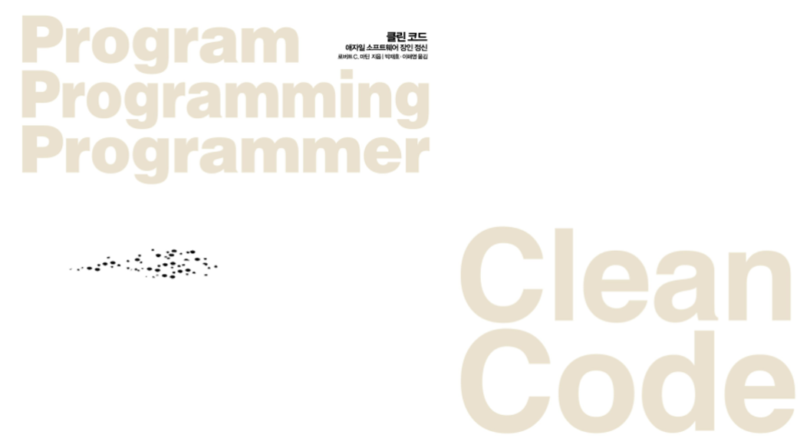

# 클린코드 북클럽

## 📖 기본 운영방식

---

📌  2주당 1회 책분량 3장으로 모임 책 내용에 대해 이야기하고 정리하는 시간을 가질거예요!

📌  정리한 책 내용은 [Soongsil.Dev](http://Soongsil.Dev) 내 repo와 wiki에 정리할 예정입니다!

📌  매 회에 해당되는 목차 내용을 물어보는 질문지를 Slack 채널에 보내드릴거예요! 

질문지를 채워가며 독서하셔도, 독서하시고 난 후에 내용을 채워도 상관없습니다! 

모임시간 직전까지 작성 부탁드려요!

📌  비동기로 참여하시는 분들은 메모한 내용을 **일요일 정오 전까지** repo issue에 작성해주세요! 

이슈 라벨은 documentation 고정입니다!

🔗 [repo](https://github.com/Soongsil-Developers/bookclub-2022-cleancode)

🔗 [wiki](https://github.com/Soongsil-Developers/bookclub-2022-cleancode/wiki)

## 🏡 모임 장소

---

📍  기본적으로 토요일 오후 12시에 학교 빈 강의실을 예약 후 공지 드릴 예정입니다. 

기본 예약을 지하철역과 가까운 경상관을 생각하고있습니다. 

혹시나 다른 좋은 의견있으면 이야기해주세요

📍 비동기로 하시는 경우 메모한 내용을 repo issue를 활용해주시면 감사하겠습니다. 

## 🗓️ 목차별 운영 방식

---

⏳ 1회차(7.3) - OT, 1장

⏳ 2회차(7.17) - 2, 3, 4장

⏳ 3회차(7.31) - 5, 6, 7장

⏳ 4회차(8.14) - 8, 9, 10장

⏳ 5회차(8.28) - 11, 12, 13장

⏳ 6회차(9.11) - 14, 15장

⏳ 7회차(9.25) - 16, 17장

## ❓ 질문지 목록

---

📄 [1회차 질문지](https://forms.gle/y763eTiFw6tGG7RX8)
